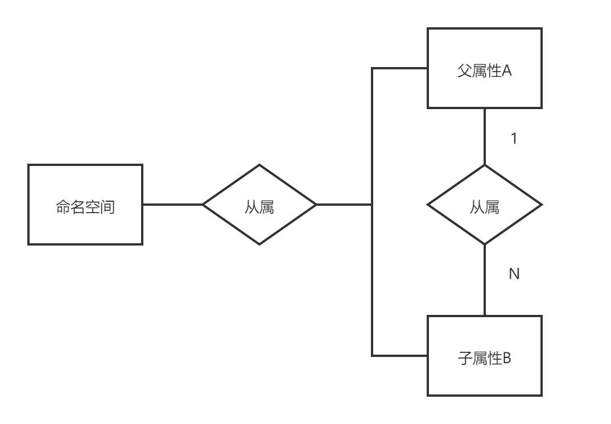
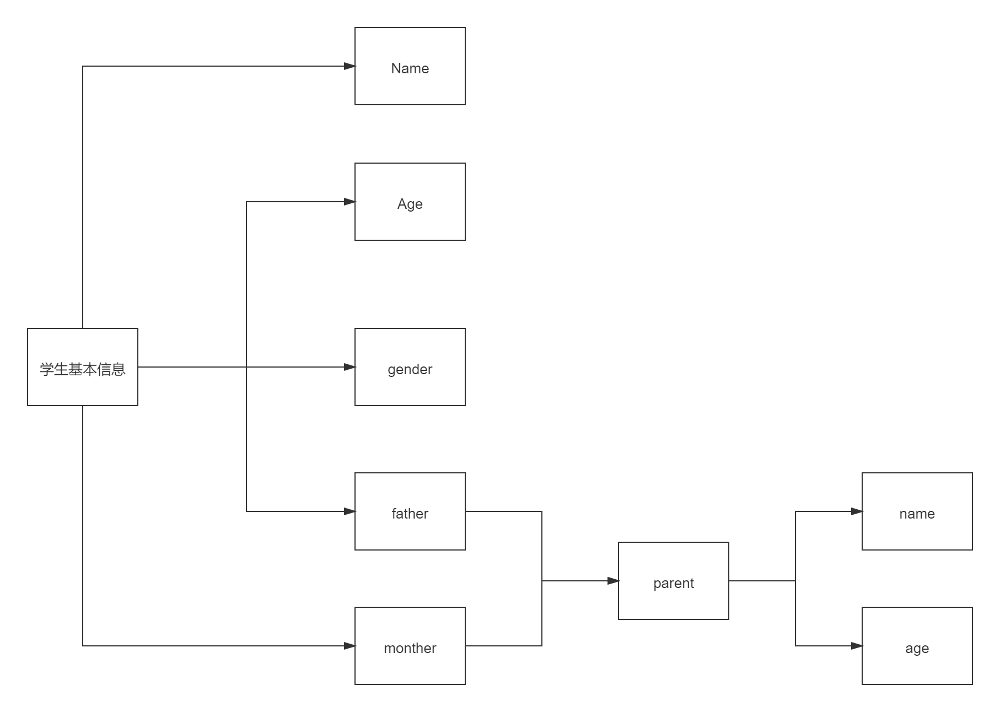

[toc]
# 属性管理

## 背景
> 决策引擎中，需要对入参进行灵活的配置，让用户可以任意的配置字段的基本信息（结构，类型，校验方式等）

## 数据库设计

### 属性集(property_set)

| 名称         | 类型   | 描述         |
| ------------ | ------ | ------------ |
| id           | string |              |
| namespace_id | string | 关联命名空间 |
| code         | string | 编码         |
| description  | string | 描述         |
|              |        |              |

### 属性(property)

| 名称           | 类型   | 描述                                                         |
| -------------- | ------ | ------------------------------------------------------------ |
| id             | string |                                                              |
|                |        |                                                              |
| namesapce_id   | string | 关联命名空间                                                 |
| field_name     | string | 字段的名称                                                   |
| field_sub_type | string | 字段子类型，两种类型，一种是自定义字段(custom)，一种是系统字段(system)，自定义字段用来描述比较复杂的数据结构并且想要抽象使用，例如嵌套，系统字段指基本的数据类型(int, string, float) |
| father_id      | string | 父数据                                                       |
| description    | string | 字段的描述                                                   |

## ER图



## 例子

> 假设有这样一种场景，我们需要接受的数据是一个学生的基本信息，其中包括他的父母的信息

### JSON数据

```json
{
    "name": "daryl",
    "age": 10,
    "gender": "man",
    "father": {
        "name": "daryl's father",
        "age": 40
    },
    "monther": {
        "name": "daryl's monther",
        "age": 40
    }
}
```

### 数据库数据

| id      | namesapce_id   | field_name | field_type | father_id | description        |
| ------- | -------------- | ---------- | ---------- | --------- | ------------------ |
| field_0 | namespace_id_1 | root       | Object     |           |                    |
| field_1 | namespace_id_1 | name       | string     | field_0   | 姓名               |
| field_2 | namespace_id_1 | age        | int        | field_0   | 年龄               |
| field_3 | namespace_id_1 | gender     | string     | field_0   | 性别，man or woman |
| field_4 | namespace_id_1 | parent     | Object     |           | 父母基本信息       |
| field_5 | namespace_id_1 | name       | string     | field_4   | 姓名               |
| field_6 | namespace_id_1 | age        | int        | field_4   | 年龄               |
| field_7 | namespace_id_1 | father     | parent     | field_0   | 父亲数据           |
| field_8 | namespace_id_1 | mother     | parent     | field_0   | 母亲数据           |

